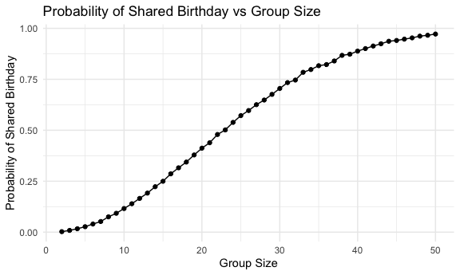
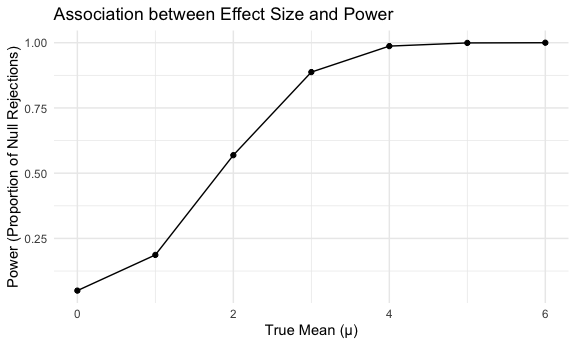
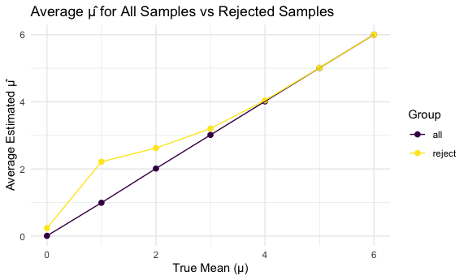
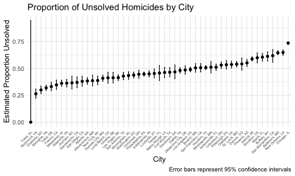

Homework 5
================

``` r
library(tidyverse)
```

    ## ── Attaching core tidyverse packages ──────────────────────── tidyverse 2.0.0 ──
    ## ✔ dplyr     1.1.4     ✔ readr     2.1.5
    ## ✔ forcats   1.0.0     ✔ stringr   1.5.1
    ## ✔ ggplot2   3.5.2     ✔ tibble    3.3.0
    ## ✔ lubridate 1.9.4     ✔ tidyr     1.3.1
    ## ✔ purrr     1.1.0     
    ## ── Conflicts ────────────────────────────────────────── tidyverse_conflicts() ──
    ## ✖ dplyr::filter() masks stats::filter()
    ## ✖ dplyr::lag()    masks stats::lag()
    ## ℹ Use the conflicted package (<http://conflicted.r-lib.org/>) to force all conflicts to become errors

``` r
library(ggplot2)
library(knitr)
library(rvest)
```

    ## 
    ## Attaching package: 'rvest'
    ## 
    ## The following object is masked from 'package:readr':
    ## 
    ##     guess_encoding

``` r
knitr::opts_chunk$set(
    echo = TRUE,
    warning = FALSE,
  fig.width = 6,
  fig.asp = .6,
  out.width = "90%"
)

theme_set(theme_minimal() + theme(legend.position = "bottom"))

options(
  ggplot2.continuous.colour = "viridis",
  ggplot2.continuous.fill = "viridis"
)

scale_colour_discrete = scale_colour_viridis_d
scale_fill_discrete = scale_fill_viridis_d

set.seed(1)
```

## Problem 1

Function that, for a fixed group size, randomly draws “birthdays” for
each person; checks whether there are duplicate birthdays in the group;
and returns `TRUE` or `FALSE` based on the result.

``` r
bday_sim = function(n) {
  bdays = sample(1:365, size = n, replace = TRUE)
  any(duplicated(bdays))
}
```

**Run this function 10000 times for each group size between 2 and 50**

``` r
sim_results =
  tibble(group_size = 2:50) %>%
  mutate(
    sim_out = map(group_size, ~ rerun(10000, bday_sim(.x))),
    sim_out = map(sim_out, unlist),
    prob = map_dbl(sim_out, mean)
  )
```

**Plot if Group size vs Probability of Shared Birthday**

``` r
sim_results %>%
  ggplot(aes(x = group_size, y = prob)) +
  geom_line() +
  geom_point() +
  labs(
    title = "Probability of Shared Birthday vs Group Size",
    x = "Group Size",
    y = "Probability of Shared Birthday"
  ) +
  theme_minimal()
```



Based off the line plot, the larger the group size, the higher the
probability of a shared birthday. For example, with a group size of 20
there is approximately 0.38 probability of a shared birthday but for 50
people group size, almost 1.00 probability indicating large likeliness
of a shared birthday within a setting. The bigger the group, the more
likely someone else shares a birthday.

## Problem 2

``` r
sim_ttest = function(mu, n = 30, sd = 5) {
  
  sim_data = tibble(
    x = rnorm(n, mean = mu, sd = sd)
  )
  
  test_res = t.test(sim_data$x, mu = 0) %>%
    broom::tidy()
  
  tibble(
    mu_hat = pull(test_res, estimate),
    p_value = pull(test_res, p.value)
  )
}
```

**Repeat the above for 𝜇={1,2,3,4,5,6}**

``` r
sim_res =
  expand_grid(
    true_mu = 0:6,
    iter = 1:5000
  ) %>%
  mutate(
    out = map(true_mu, ~ sim_ttest(mu = .x))
  ) %>%
  unnest(out)
```

**Plot of Power of Test vs True value of μ**

``` r
sim_res %>%
  mutate(reject = p_value < 0.05) %>%
  group_by(true_mu) %>%
  summarize(prob_reject = mean(reject)) %>%
  ggplot(aes(x = true_mu, y = prob_reject)) +
  geom_point() +
  geom_line() +
  labs(
    x = "True Mean (μ)",
    y = "Power (Proportion of Null Rejections)",
    title = "Association between Effect Size and Power"
  )
```



As the true mean increases, the power (proportion of null rejections)
increases as well. As the true mean increases from 0-6 the power of the
one-sample t-test increases significantly. Specifically from μ ≥ 3,
power accelerates quickly and plateaus at μ =5 and 6 as power is
nearly 1. Overall, we see a positive correlation.

**Plot Average Estimate of 𝜇̂ vs True Value of 𝜇**

``` r
all_sim_plot =
  sim_res %>%
  group_by(true_mu) %>%
  summarize(mean_mu_hat = mean(mu_hat)) %>%
  mutate(type = "all")


reject_sim_plot =
  sim_res %>%
  filter(p_value < 0.05) %>%
  group_by(true_mu) %>%
  summarize(mean_mu_hat = mean(mu_hat)) %>%
  mutate(type = "reject")

combined_mu =
  bind_rows(all_sim_plot, reject_sim_plot)
```

**Combined Plot: True Mean vs Average Estimated μ**

``` r
combined_mu %>%
  ggplot(aes(x = true_mu, y = mean_mu_hat, color = type)) +
  geom_point(size = 2) +
  geom_line() +
  labs(
    x = "True Mean (μ)",
    y = "Average Estimated μ̂",
    color = "Group",
    title = "Average μ̂ for All Samples vs Rejected Samples"
  ) +
  theme_minimal()
```



The average 𝜇^ across all samples is approximately equal to the true
𝜇when 4 and greater. However, when looking at rejected null value
samples, 𝜇^ is inflated for small true mean values (3 and less). This
happens because rejection of the null requires observing a sample mean
that is far from 0 so extreme samples end of rejected. As a result, it
means that rejected samples are not usually representative of all the
possible samples and bias is seen as 𝜇^ average increases also
increasing power. Eventually the rejected average converges with the
overall average and both align with the true 𝜇.

## Problem 3

``` r
library(tidyverse)

homicides = read_csv("data/homicide-data.csv") %>% 
  janitor::clean_names() %>% 
  mutate(
    city_state = str_c(city, ", ", state), 
    unsolved = disposition %in% c("Closed without arrest", "Open/No arrest")
    ) %>% 
  group_by(city_state) %>% 
  summarize(
    total_homicides = n(),
    unsolved_homicides = sum(unsolved, na.rm = TRUE)
  ) 
```

    ## Rows: 52179 Columns: 12
    ## ── Column specification ────────────────────────────────────────────────────────
    ## Delimiter: ","
    ## chr (9): uid, victim_last, victim_first, victim_race, victim_age, victim_sex...
    ## dbl (3): reported_date, lat, lon
    ## 
    ## ℹ Use `spec()` to retrieve the full column specification for this data.
    ## ℹ Specify the column types or set `show_col_types = FALSE` to quiet this message.

**Proportion of homicides that are unsolved**

``` r
baltimore_df =
  homicides %>%
  filter(city_state == "Baltimore, MD")

baltimore_prop =
  prop.test(
    x = baltimore_df$unsolved_homicides,
    n = baltimore_df$total_homicides
  )

baltimore_tidy_result = broom::tidy(baltimore_prop) %>%
  select(estimate, conf.low, conf.high) %>%
  knitr::kable()

knitr::kable(baltimore_tidy_result)
```

| x                                      |
|:---------------------------------------|
| \| estimate\| conf.low\| conf.high\|   |
| \|———:\|———:\|———:\|                   |
| \| 0.6455607\| 0.6275625\| 0.6631599\| |

**Extract both the proportion of unsolved homicides and the confidence
interval for each**

``` r
cities_df = homicides %>% 
  mutate(
    prop_test = map2(unsolved_homicides, total_homicides, ~ prop.test(x = .x, n = .y)),
    tidy_result = map(prop_test, broom::tidy) 
  ) %>% 
  unnest(tidy_result) %>% 
  select(city_state, estimate, conf.low, conf.high) 
```

**Plot of Estimates and CI for each City**

``` r
cities_df = cities_df %>% 
  mutate(city_state = fct_reorder(city_state, estimate))

cities_df %>%
  ggplot(aes(x = city_state, y = estimate)) +
  geom_point() +
  geom_errorbar(aes(ymin = conf.low, ymax = conf.high), width = 0.2) +
  labs(
    title = "Proportion of Unsolved Homicides by City",
    x = "City",
    y = "Estimated Proportion Unsolved",
    caption = "Error bars represent 95% confidence intervals"
  ) +
  theme_minimal() +
  theme(
    axis.text.x = element_text(angle = 45, hjust = 1, size = 5)
  )
```


